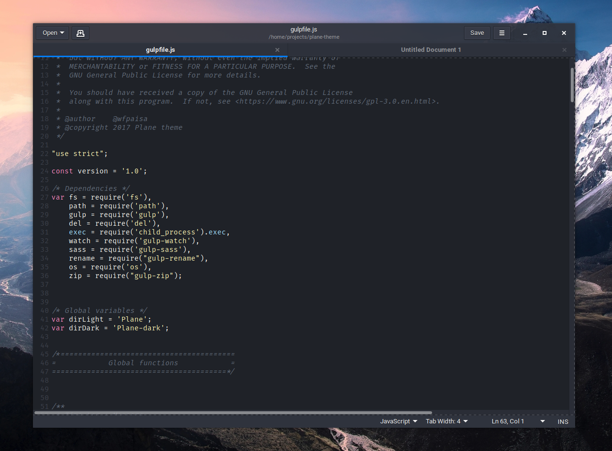

# PLANE-GEDIT THEME

A beautiful theme for Gedit, more information in [Plane project](https://github.com/wfpaisa/plane)

 

## Install
1. Download in `~/home/felipe/.local/share/gedit/styles/plane-gedit.xml`
2. Open: Gedit -> Preferences -> Font & Color | choose: Plane Gedit

## License

[MIT License](./LICENSE)
